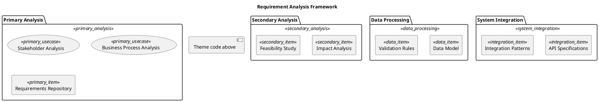

# 🔬 Blue Analyst

**Design Philosophy**: Professional rationality • Logic clarity • Analysis-focused

A theme that embodies the spirit of rigorous analysis with blue-green and purple color systems, representing professional rationality and logical clarity. Perfect for requirement analysis, use case diagrams, and scenarios that emphasize systematic thinking and analytical precision.

## Color Palette

### Primary Analysis Layer
- **Package Background**: `#E1F5FE` - Ice blue
- **Item Background**: `#B3E5FC` - Light cyan
- **Border Color**: `#0288D1` - Primary blue
- **Font Color**: `#333333` - Dark charcoal

### Secondary Analysis Layer
- **Package Background**: `#F3E5F5` - Light lavender
- **Item Background**: `#E1BEE7` - Medium purple
- **Border Color**: `#8E24AA` - Primary purple
- **Font Color**: `#333333` - Dark charcoal

### Data Processing Layer
- **Package Background**: `#E0F2F1` - Mint green
- **Item Background**: `#B2DFDB` - Light teal
- **Border Color**: `#00796B` - Primary teal
- **Font Color**: `#333333` - Dark charcoal

### System Integration Layer
- **Package Background**: `#FFF3E0` - Light orange
- **Item Background**: `#FFE0B2` - Medium orange
- **Border Color**: `#F57C00` - Primary orange
- **Font Color**: `#333333` - Dark charcoal

## Best Used For

- Requirement analysis diagrams
- Use case modeling
- Data flow diagrams
- System analysis documentation
- Business rule visualization
- Logical architecture designs

## PlantUML Theme Code

```plantuml
' 🔬 Blue Analyst Theme
' Professional rationality, logic clarity, analysis-focused

skinparam backgroundColor #FAFAFA
skinparam defaultFontName "Microsoft YaHei"
skinparam shadowing true
skinparam roundcorner 5

' Text optimization for analysis clarity
skinparam package {
  FontStyle normal
  FontSize 12
  FontColor #333333
  BorderThickness 2
}
skinparam rectangle {
  FontStyle normal
  FontSize 10
  FontColor #333333
  BorderThickness 1
}
skinparam usecase {
  FontColor #333333
}

' Primary Analysis Layer - Blue system
skinparam package {
  BackgroundColor<<primary_analysis>> #E1F5FE
  BorderColor<<primary_analysis>> #0288D1
}
skinparam rectangle {
  BackgroundColor<<primary_item>> #B3E5FC
  BorderColor<<primary_item>> #0288D1
  FontColor<<primary_item>> #333333
}
skinparam usecase {
  BackgroundColor<<primary_usecase>> #B3E5FC
  BorderColor<<primary_usecase>> #0288D1
  FontColor<<primary_usecase>> #333333
}

' Secondary Analysis Layer - Purple system
skinparam package {
  BackgroundColor<<secondary_analysis>> #F3E5F5
  BorderColor<<secondary_analysis>> #8E24AA
}
skinparam rectangle {
  BackgroundColor<<secondary_item>> #E1BEE7
  BorderColor<<secondary_item>> #8E24AA
  FontColor<<secondary_item>> #333333
}

' Data Processing Layer - Teal system
skinparam package {
  BackgroundColor<<data_processing>> #E0F2F1
  BorderColor<<data_processing>> #00796B
}
skinparam rectangle {
  BackgroundColor<<data_item>> #B2DFDB
  BorderColor<<data_item>> #00796B
  FontColor<<data_item>> #333333
}

' System Integration Layer - Orange system
skinparam package {
  BackgroundColor<<system_integration>> #FFF3E0
  BorderColor<<system_integration>> #F57C00
}
skinparam rectangle {
  BackgroundColor<<integration_item>> #FFE0B2
  BorderColor<<integration_item>> #F57C00
  FontColor<<integration_item>> #333333
}

' Connection styles for logical flow
skinparam arrow {
  Color #0288D1
  FontColor #333333
  Thickness 2
}
```

## Usage Example

