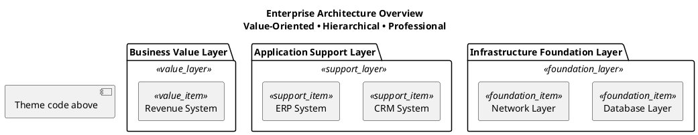

# 🏛️ Golden Pyramid Executive

**Design Philosophy**: Stable foundation • Collaborative support • Value-oriented

A professional and authoritative theme that evokes the eternal design wisdom of ancient pyramids. Features a three-tier gradient design with golden value top layer, blue support middle layer, and gray stable foundation layer, perfectly embodying the hierarchical nature and value orientation of system architecture.

## Color Palette

### Value Layer (Pyramid Top)
- **Package Background**: `#FFE6CC` - Light golden cream
- **Item Background**: `#FFA500` - Orange gold  
- **Border Color**: `#FFD700` - Pure gold
- **Font Color**: `#404040` - Professional dark gray

### Support Layer (Pyramid Middle)  
- **Package Background**: `#E6F3FF` - Light sky blue
- **Item Background**: `#87CEEB` - Sky blue
- **Border Color**: `#4682B4` - Steel blue
- **Font Color**: `#404040` - Professional dark gray

### Foundation Layer (Pyramid Base)
- **Package Background**: `#F0F8FF` - Alice blue  
- **Item Background**: `#E0E0E0` - Light gray
- **Border Color**: `#708090` - Slate gray
- **Font Color**: `#404040` - Professional dark gray

## Best Used For

- Corporate presentations
- Executive reporting
- System architecture diagrams
- Strategic planning visuals
- Hierarchical structure displays
- High-level business presentations

## PlantUML Theme Code

```plantuml
' 🏛️ Golden Pyramid Executive Theme
' Professional, stable, clear hierarchy

skinparam backgroundColor #FAFAFA
skinparam defaultFontName "Microsoft YaHei"  
skinparam shadowing true
skinparam roundcorner 8

' Text optimization - 75% dark gray for elegance
skinparam package {
  FontStyle normal
  FontSize 14
  FontColor #404040
  BorderThickness 2
}
skinparam rectangle {
  FontStyle normal
  FontSize 11
  FontColor #404040
  BorderThickness 2
}

' Value Layer - Gold system (Pyramid top)
skinparam package {
  BackgroundColor<<value_layer>> #FFE6CC
  BorderColor<<value_layer>> #FFD700  
}
skinparam rectangle {
  BackgroundColor<<value_item>> #FFA500
  BorderColor<<value_item>> #FF8C00
  FontColor<<value_item>> #404040
}

' Support Layer - Blue system (Pyramid middle)
skinparam package {
  BackgroundColor<<support_layer>> #E6F3FF
  BorderColor<<support_layer>> #4682B4
}
skinparam rectangle {
  BackgroundColor<<support_item>> #87CEEB
  BorderColor<<support_item>> #4682B4
  FontColor<<support_item>> #404040
}

' Foundation Layer - Gray system (Pyramid base)
skinparam package {
  BackgroundColor<<foundation_layer>> #F0F8FF  
  BorderColor<<foundation_layer>> #708090
}
skinparam rectangle {
  BackgroundColor<<foundation_item>> #E0E0E0
  BorderColor<<foundation_item>> #808080
  FontColor<<foundation_item>> #404040
}

' Connection styles
skinparam arrow {
  Color #4682B4
  FontColor #404040
  Thickness 2
}
```

## Usage Example

