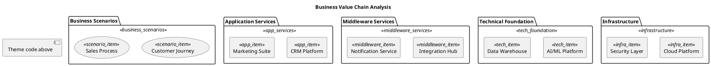

# 🌈 Rainbow Innovator

**Design Philosophy**: Value-driven • Scenario-driven • Vibrant creativity

Like a rainbow with its rich and colorful gradient combinations, each color carries different business values and innovative concepts. Symbolizes the diverse thinking and unlimited creativity of innovators, perfect for business process diagrams and value chain displays that need to highlight innovation and diversity.

## Color Palette

### Business Scenarios Layer
- **Package Background**: `#FFE082` - Light amber
- **Item Background**: `#FFF176` - Light yellow
- **Border Color**: `#F57F17` - Deep orange
- **Font Color**: `#333333` - Dark charcoal

### Application Services Layer
- **Package Background**: `#B39DDB` - Light purple
- **Item Background**: `#CE93D8` - Medium purple
- **Border Color**: `#7B1FA2` - Deep purple
- **Font Color**: `white` - White text for contrast

### Middleware Services Layer
- **Package Background**: `#4FC3F7` - Light blue
- **Item Background**: `#29B6F6` - Medium blue
- **Border Color**: `#0277BD` - Deep blue
- **Font Color**: `white` - White text for contrast

### Technical Foundation Layer
- **Package Background**: `#81C784` - Light green
- **Item Background**: `#A5D6A7` - Medium green
- **Border Color**: `#388E3C` - Deep green
- **Font Color**: `#333333` - Dark charcoal

### Infrastructure Layer
- **Package Background**: `#FFAB91` - Light orange
- **Item Background**: `#FFCC02` - Bright yellow
- **Border Color**: `#E65100` - Deep orange
- **Font Color**: `#333333` - Dark charcoal

## Best Used For

- Business process diagrams
- Value chain visualizations
- Innovation showcases
- Multi-stakeholder workflows
- Creative project presentations
- Diverse system integrations

## PlantUML Theme Code

```plantuml
' 🌈 Rainbow Innovator Theme
' Value-driven, scenario-driven, vibrant creativity

skinparam backgroundColor #FAFAFA
skinparam defaultFontName "Microsoft YaHei"
skinparam shadowing true

' Text settings
skinparam package {
  FontStyle normal
  FontColor #333333
}
skinparam rectangle {
  FontStyle normal
  FontColor #333333
}
skinparam usecase {
  FontColor #333333
}

' Business Scenarios Layer - Yellow system
skinparam package {
  BackgroundColor<<business_scenarios>> #FFE082
  BorderColor<<business_scenarios>> #FFC107
}
skinparam usecase {
  BackgroundColor<<scenario_item>> #FFF176
  BorderColor<<scenario_item>> #F57F17
  FontColor<<scenario_item>> #333333
}

' Application Services Layer - Purple system
skinparam package {
  BackgroundColor<<app_services>> #B39DDB
  BorderColor<<app_services>> #9C27B0
}
skinparam rectangle {
  BackgroundColor<<app_item>> #CE93D8
  BorderColor<<app_item>> #7B1FA2
  FontColor<<app_item>> white
}

' Middleware Services Layer - Blue system
skinparam package {
  BackgroundColor<<middleware_services>> #4FC3F7
  BorderColor<<middleware_services>> #03A9F4
}
skinparam rectangle {
  BackgroundColor<<middleware_item>> #29B6F6
  BorderColor<<middleware_item>> #0277BD
  FontColor<<middleware_item>> white
}

' Technical Foundation Layer - Green system
skinparam package {
  BackgroundColor<<tech_foundation>> #81C784
  BorderColor<<tech_foundation>> #4CAF50
}
skinparam rectangle {
  BackgroundColor<<tech_item>> #A5D6A7
  BorderColor<<tech_item>> #388E3C
  FontColor<<tech_item>> #333333
}

' Infrastructure Layer - Orange system
skinparam package {
  BackgroundColor<<infrastructure>> #FFAB91
  BorderColor<<infrastructure>> #FF5722
}
skinparam rectangle {
  BackgroundColor<<infra_item>> #FFCC02
  BorderColor<<infra_item>> #E65100
  FontColor<<infra_item>> #333333
}
```

## Usage Example

