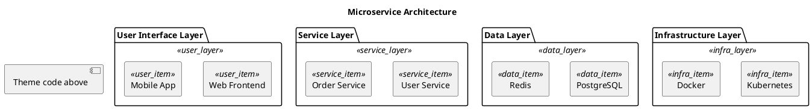

# ☁️ Sky Explorer

**Design Philosophy**: Modern technology • Fresh simplicity • Tech-oriented

Like the clear blue sky, this theme combines blue tones with AWS orange accents, symbolizing the pioneering spirit and innovative thinking of technology explorers. Embodies the modern feel of cloud-native technology and boundless thinking, perfect for technical architecture and microservice design scenarios.

## Color Palette

### User Layer
- **Package Background**: `#E3F2FD` - Light blue
- **Item Background**: `#BBDEFB` - Medium blue
- **Border Color**: `#1976D2` - Primary blue
- **Font Color**: `#333333` - Dark charcoal

### Service Layer
- **Package Background**: `#FFF3E0` - Light orange
- **Item Background**: `#FFE0B2` - Medium orange
- **Border Color**: `#F57C00` - Primary orange
- **Font Color**: `#333333` - Dark charcoal

### Data Layer
- **Package Background**: `#F3E5F5` - Light purple
- **Item Background**: `#E1BEE7` - Medium purple
- **Border Color**: `#7B1FA2` - Primary purple
- **Font Color**: `#333333` - Dark charcoal

### Infrastructure Layer
- **Package Background**: `#F1F8E9` - Light green
- **Item Background**: `#DCEDC1` - Medium green
- **Border Color**: `#388E3C` - Primary green
- **Font Color**: `#333333` - Dark charcoal

## Best Used For

- Technical architecture diagrams
- Microservice designs
- Cloud-native applications
- API documentation
- DevOps workflows
- Technology innovation presentations

## PlantUML Theme Code

```plantuml
' ☁️ Sky Explorer Theme
' Modern technology, fresh simplicity, tech-oriented

!theme aws-orange
skinparam backgroundColor white
skinparam defaultFontName "Microsoft YaHei"
skinparam shadowing true
skinparam roundcorner 10

' Text optimization
skinparam package {
  FontStyle normal
  FontColor #333333
}
skinparam rectangle {
  FontStyle normal
  FontColor #333333
}

' User Layer - Blue system
skinparam package {
  BackgroundColor<<user_layer>> #E3F2FD
  BorderColor<<user_layer>> #2196F3
}
skinparam rectangle {
  BackgroundColor<<user_item>> #BBDEFB
  BorderColor<<user_item>> #1976D2
  FontColor<<user_item>> #333333
}

' Service Layer - Orange system
skinparam package {
  BackgroundColor<<service_layer>> #FFF3E0
  BorderColor<<service_layer>> #FF9800
}
skinparam rectangle {
  BackgroundColor<<service_item>> #FFE0B2
  BorderColor<<service_item>> #F57C00
  FontColor<<service_item>> #333333
}

' Data Layer - Purple system
skinparam package {
  BackgroundColor<<data_layer>> #F3E5F5
  BorderColor<<data_layer>> #9C27B0
}
skinparam rectangle {
  BackgroundColor<<data_item>> #E1BEE7
  BorderColor<<data_item>> #7B1FA2
  FontColor<<data_item>> #333333
}

' Infrastructure Layer - Green system
skinparam package {
  BackgroundColor<<infra_layer>> #F1F8E9
  BorderColor<<infra_layer>> #4CAF50
}
skinparam rectangle {
  BackgroundColor<<infra_item>> #DCEDC1
  BorderColor<<infra_item>> #388E3C
  FontColor<<infra_item>> #333333
}
```

## Usage Example

