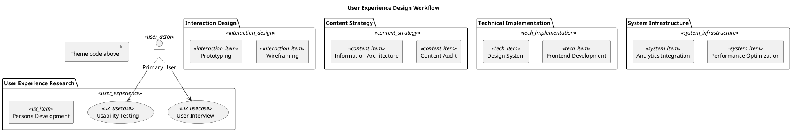

# 🎨 Warm Designer

**Design Philosophy**: Humanized • User-friendly • Balanced aesthetics

A theme that balances warm and cool colors, embodying human-centered design principles and user-friendly aesthetics. Perfect for user journey mapping, interface prototypes, and UX workflows that emphasize empathy and user experience.

## Color Palette

### User Experience Layer
- **Package Background**: `#FFEBEE` - Light rose
- **Item Background**: `#FFCDD2` - Pink blush
- **Border Color**: `#E91E63` - Primary pink
- **Font Color**: `#333333` - Dark charcoal

### Interaction Design Layer
- **Package Background**: `#FFF3E0` - Light peach
- **Item Background**: `#FFE0B2` - Warm orange
- **Border Color**: `#FF9800` - Primary orange
- **Font Color**: `#333333` - Dark charcoal

### Content Strategy Layer
- **Package Background**: `#F3E5F5` - Light lavender
- **Item Background**: `#E1BEE7` - Soft purple
- **Border Color**: `#9C27B0` - Primary purple
- **Font Color**: `#333333` - Dark charcoal

### Technical Implementation Layer
- **Package Background**: `#E8F5E8` - Light mint
- **Item Background**: `#C8E6C9` - Soft green
- **Border Color**: `#4CAF50` - Primary green
- **Font Color**: `#333333` - Dark charcoal

### System Infrastructure Layer
- **Package Background**: `#E3F2FD` - Light sky blue
- **Item Background**: `#BBDEFB` - Soft blue
- **Border Color**: `#2196F3` - Primary blue
- **Font Color**: `#333333` - Dark charcoal

## Best Used For

- User experience design
- Customer journey mapping
- Interface prototyping
- Design system documentation
- User-centered workflows
- Human-computer interaction models

## PlantUML Theme Code

```plantuml
' 🎨 Warm Designer Theme
' Humanized, user-friendly, balanced aesthetics

skinparam backgroundColor #FEFEFE
skinparam defaultFontName "Microsoft YaHei"
skinparam shadowing true
skinparam roundcorner 8

' Text optimization for readability
skinparam package {
  FontStyle normal
  FontSize 12
  FontColor #333333
  BorderThickness 2
}
skinparam rectangle {
  FontStyle normal
  FontSize 10
  FontColor #333333
  BorderThickness 1
}
skinparam usecase {
  FontColor #333333
}
skinparam actor {
  FontColor #333333
}

' User Experience Layer - Rose/Pink system
skinparam package {
  BackgroundColor<<user_experience>> #FFEBEE
  BorderColor<<user_experience>> #E91E63
}
skinparam rectangle {
  BackgroundColor<<ux_item>> #FFCDD2
  BorderColor<<ux_item>> #E91E63
  FontColor<<ux_item>> #333333
}
skinparam usecase {
  BackgroundColor<<ux_usecase>> #FFCDD2
  BorderColor<<ux_usecase>> #E91E63
  FontColor<<ux_usecase>> #333333
}
skinparam actor {
  BackgroundColor<<user_actor>> #FFCDD2
  BorderColor<<user_actor>> #E91E63
  FontColor<<user_actor>> #333333
}

' Interaction Design Layer - Orange system
skinparam package {
  BackgroundColor<<interaction_design>> #FFF3E0
  BorderColor<<interaction_design>> #FF9800
}
skinparam rectangle {
  BackgroundColor<<interaction_item>> #FFE0B2
  BorderColor<<interaction_item>> #FF9800
  FontColor<<interaction_item>> #333333
}

' Content Strategy Layer - Purple system
skinparam package {
  BackgroundColor<<content_strategy>> #F3E5F5
  BorderColor<<content_strategy>> #9C27B0
}
skinparam rectangle {
  BackgroundColor<<content_item>> #E1BEE7
  BorderColor<<content_item>> #9C27B0
  FontColor<<content_item>> #333333
}

' Technical Implementation Layer - Green system
skinparam package {
  BackgroundColor<<tech_implementation>> #E8F5E8
  BorderColor<<tech_implementation>> #4CAF50
}
skinparam rectangle {
  BackgroundColor<<tech_item>> #C8E6C9
  BorderColor<<tech_item>> #4CAF50
  FontColor<<tech_item>> #333333
}

' System Infrastructure Layer - Blue system
skinparam package {
  BackgroundColor<<system_infrastructure>> #E3F2FD
  BorderColor<<system_infrastructure>> #2196F3
}
skinparam rectangle {
  BackgroundColor<<system_item>> #BBDEFB
  BorderColor<<system_item>> #2196F3
  FontColor<<system_item>> #333333
}

' Connection styles for user flows
skinparam arrow {
  Color #666666
  FontColor #333333
  Thickness 2
}
```

## Usage Example

