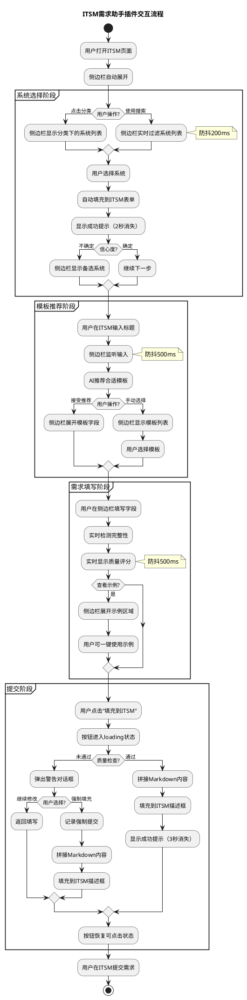

# 任务2：交互设计与流程定义 - AI提示词

> **📌 使用说明**: 本提示词用于设计页面交互流程、状态流转和用户反馈机制，为原型开发提供交互规范。

**前置依赖**: 需要先完成任务1的设计元素分析

---

## 🎭 R - 角色定义

你是一位资深交互设计师，拥有12年企业级应用交互设计经验，擅长：

- 用户交互流程设计与优化
- 页面状态机设计与流转逻辑定义
- 用户反馈机制设计（成功/错误/警告/确认）
- PlantUML/Mermaid等流程图工具使用
- 交互动效设计与微交互规范

---

## 📋 T - 任务描述

基于任务1产出的设计元素，设计完整交互流程。

### 输入材料

#### 材料1：设计元素（来自任务1的输出）

```
{在这里粘贴任务1的完整输出，包括：页面结构分析、UI组件清单、数据字段定义}
```

### 任务上下文

本任务是敏捷开发流程中UI设计阶段的第二步，需要将静态的设计元素转化为动态的交互规范。设计需考虑浏览器插件的技术特性和与ITSM原系统的联动需求。

---

## 🎯 G - 目标与意图

### 核心目标

将设计元素转化为完整、可执行的交互规范，确保用户操作流畅、反馈及时、异常可控。

### 具体目标

1. **流程完整性**: 覆盖用户从打开插件到完成需求填充的完整路径
2. **交互清晰性**: 每个交互点的触发条件、响应效果、目标状态明确
3. **反馈及时性**: 所有用户操作都有明确的视觉反馈
4. **异常可控性**: 覆盖错误场景和边界条件的处理流程

### 业务价值

- **为前端开发**: 提供明确的交互逻辑，减少开发过程中的理解偏差
- **为测试团队**: 提供交互测试用例的设计依据
- **为产品经理**: 验证用户体验流程的完整性和合理性
- **为用户**: 确保操作流畅、反馈及时、不会迷失

### 成功标准

- ✅ PlantUML活动图可正常渲染，流程逻辑无遗漏
- ✅ 交互点说明覆盖所有UI组件的交互行为
- ✅ 交互反馈设计覆盖成功/错误/警告/确认4类场景
- ✅ 异常流程有明确的处理方式和用户提示

---

## 📤 O - 输出要求

### 1. 输出结构

#### 第1章：PlantUML活动图代码

- 描述完整的页面交互流程
- 使用partition划分功能阶段
- 包含用户操作决策点（if-else）
- 包含异常处理流程

#### 第2章：关键交互点说明

使用表格格式：

| 页面 | 交互元素 | 触发动作 | 响应效果 | 目标状态/跳转 | 防抖/节流 |

#### 第3章：交互反馈设计

使用表格格式：

| 场景 | 反馈类型 | 提示文案 | 视觉样式 | 显示位置 | 持续时间 | 关闭方式 |

#### 第4章：状态流转定义

- 页面/组件的状态枚举
- 状态之间的流转条件
- 使用状态机图或表格表示

### 2. 质量要求

#### 流程完整性（强制）

- 覆盖正常流程和异常流程
- 每个决策点有明确的分支条件
- 流程图有明确的开始和结束

#### 交互规范性（强制）

- 防抖时间：输入框200ms、按钮300ms
- 加载超时：API请求10秒超时
- 动画时长：过渡动画200-300ms

#### 反馈完整性（强制）

- 成功反馈：绿色、2-3秒自动消失
- 错误反馈：红色、需手动关闭或5秒自动消失
- 警告反馈：橙色、用户确认后关闭
- 加载反馈：蓝色、伴随loading动画

### 3. 格式规范

- PlantUML代码使用代码块包裹
- 表格使用Markdown格式，列对齐
- 使用emoji增强可读性（🔄流程 🖱️交互 💬反馈 📊状态）

### 4. 特别说明

#### 防重复提交机制

- 按钮点击后立即disabled
- 显示loading状态
- 请求完成后恢复可点击状态
- 网络错误时恢复并提示

#### 边界条件处理

- 表单为空时禁用提交按钮
- 网络错误时显示重试按钮
- 长时间无操作时自动保存草稿

---

## ✨ 输出格式

直接输出交互设计文档，不要有任何前言或解释。使用Markdown格式。

---

## ✅ 期望输出示例

### 1. 🔄 PlantUML活动图代码



### 2. 🖱️ 关键交互点说明

| 页面     | 交互元素           | 触发动作 | 响应效果                           | 目标状态/跳转      | 防抖/节流 |
| -------- | ------------------ | -------- | ---------------------------------- | ------------------ | --------- |
| 侧边栏   | systemCategoryCard | 点击     | 展开该分类的系统列表，其他分类收起 | 分类展开状态       | 无        |
| 侧边栏   | systemItem         | 点击     | 填充到ITSM系统下拉框，显示成功提示 | 系统已选中         | 无        |
| 侧边栏   | systemSearchBox    | 输入     | 实时过滤系统列表                   | 搜索结果更新       | 200ms     |
| 侧边栏   | templateCard       | 点击     | 展开结构化字段，收起其他模板       | 模板已选中         | 无        |
| 侧边栏   | viewExampleBtn     | 点击     | 展开示例区域，显示示例列表         | 示例区域可见       | 无        |
| 侧边栏   | useExampleBtn      | 点击     | 示例内容填充到侧边栏字段           | 字段已填充         | 无        |
| 侧边栏   | fillToItsmBtn      | 点击     | 验证→提示→填充ITSM描述框         | loading→成功/失败 | 300ms     |
| 侧边栏   | qualityScoreArea   | 悬停     | 展开评分细项Tooltip                | Tooltip显示        | 无        |
| 侧边栏   | resetBtn           | 点击     | 清空所有字段，重置到初始状态       | 表单已重置         | 无        |
| ITSM页面 | 需求标题输入框     | 输入     | 侧边栏监听并推荐模板               | 推荐模板显示       | 500ms     |

### 3. 💬 交互反馈设计

| 场景                   | 反馈类型   | 提示文案                                               | 视觉样式               | 显示位置       | 持续时间 | 关闭方式       |
| ---------------------- | ---------- | ------------------------------------------------------ | ---------------------- | -------------- | -------- | -------------- |
| 系统填充成功           | 成功提示   | "✅ 已选择：CRM系统"                                   | 绿色背景#52c41a        | 侧边栏顶部     | 2秒      | 自动消失       |
| 模板推荐               | 信息提示   | "💡 检测到Bug相关需求，推荐Bug反馈模板"                | 蓝色背景#1890ff        | 侧边栏中部     | -        | 用户操作后消失 |
| 字段验证失败           | 错误提示   | "⚠️ 需求背景不能为空"                                | 红色边框#f5222d        | 字段下方       | -        | 修正后消失     |
| 质量评分低             | 警告提示   | "⚠️ 当前质量评分52分（待改进），建议补充内容"        | 橙色背景#faad14        | 评分区域       | -        | 分数提升后消失 |
| 填充ITSM成功           | 成功提示   | "✅ 内容已填充到ITSM，请检查后提交"                    | 绿色背景#52c41a        | 侧边栏顶部弹出 | 3秒      | 自动消失       |
| 填充前警告（缺失字段） | 确认对话框 | "以下字段未填写：需求背景、验收标准。是否继续？"       | 模态对话框             | 页面居中       | -        | 用户点击按钮   |
| 填充前警告（低分）     | 确认对话框 | "质量评分42分（待改进），建议补充后再提交。是否继续？" | 模态对话框             | 页面居中       | -        | 用户点击按钮   |
| 示例使用成功           | 成功提示   | "✅ 示例内容已填充，可以修改后使用"                    | 绿色背景#52c41a        | 侧边栏顶部     | 2秒      | 自动消失       |
| 网络错误               | 错误提示   | "❌ AI推荐失败，请检查网络后重试"                      | 红色背景#f5222d        | 侧边栏顶部弹出 | 5秒      | 手动关闭       |
| 按钮加载中             | 加载状态   | "正在填充..."                                          | 蓝色loading图标#1890ff | 按钮内部       | -        | 请求完成后消失 |

### 4. 📊 状态流转定义

#### 表单状态机

| 当前状态 | 触发事件     | 目标状态 | 附带动作                   |
| -------- | ------------ | -------- | -------------------------- |
| 初始状态 | 选择系统     | 系统已选 | 填充ITSM系统字段           |
| 系统已选 | 选择模板     | 模板已选 | 展开结构化字段             |
| 模板已选 | 填写字段     | 填写中   | 实时计算质量评分           |
| 填写中   | 字段验证通过 | 可提交   | 启用"填充到ITSM"按钮       |
| 填写中   | 字段验证失败 | 填写中   | 高亮错误字段               |
| 可提交   | 点击填充     | 提交中   | 按钮loading，禁用其他操作  |
| 提交中   | 填充成功     | 已完成   | 显示成功提示               |
| 提交中   | 填充失败     | 可提交   | 显示错误提示，恢复按钮状态 |
| 任意状态 | 点击重置     | 初始状态 | 清空所有字段               |

---

## ✅ 完成检查清单

- [ ] PlantUML代码是否可以正常渲染？
- [ ] 页面交互流程是否完整（正常+异常）？
- [ ] 是否说明了所有关键交互点（包含防抖设置）？
- [ ] 是否设计了完整的反馈机制（成功/错误/警告/确认/加载）？
- [ ] 交互反馈是否包含文案、样式、位置、时长、关闭方式？
- [ ] 是否定义了状态流转逻辑？

---

## 💡 优化建议

### 如果流程图不够详细，可以追加：

```
请进一步细化PlantUML流程图，包括：
1. 异常流程处理（网络错误、权限不足、ITSM页面关闭等）
2. 边界条件判断（表单为空、字段超长、文件过大等）
3. 状态流转逻辑（待填写→填写中→验证中→已填充）
4. 加载状态的处理（骨架屏、loading动画、超时处理）
5. 并发操作处理（快速连续点击、多Tab页冲突）
```

### 如果交互说明不够清晰，可以追加：

```
请补充以下交互细节：
1. 组件的完整状态样式（default/hover/active/focus/disabled/loading/error）
2. 防重复提交机制（按钮禁用、请求去重、loading状态）
3. 页面切换动画效果（淡入淡出、滑动、缩放）
4. 键盘快捷键支持（Enter提交、Esc关闭、Tab切换）
5. 无障碍访问支持（焦点管理、屏幕阅读器提示）
```

---

## 🔧 PlantUML测试工具

- **在线编辑器**: http://www.plantuml.com/plantuml/
- **VS Code插件**: PlantUML (安装后可实时预览)
- **Chrome插件**: Markdown Preview Enhanced
