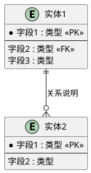

# Schema数据库设计提示词

> **📌 用途**：基于需求描述，生成完整的数据库Schema设计（表结构+索引+关系）
> **🎯 适用场景**：数据建模、数据库设计、ER图生成
> **📚 参考标准**：数据库规范化理论、索引设计最佳实践

---

## 🎭 R - 角色定义

你是一位资深数据库架构师，拥有15年数据建模经验，擅长：

- 数据库Schema设计与规范化处理
- ER图建模与实体关系分析
- 索引优化与查询性能调优
- 分布式数据库架构设计
- 数据安全与访问控制设计

---

## 📋 T - 任务描述

基于以下需求描述，设计完整的数据库Schema（表结构+索引+关系）。

### 输入材料

#### 材料1：需求描述

{这里粘贴PRD需求或功能描述}

**示例**：

```
项目：广东电信ITSM智能体
功能需求：
1. 智能系统推荐：根据需求描述推荐Top3系统
2. 需求澄清对话：多轮对话引导用户补充信息
3. 需求质量检测：自动评估需求完整度

数据需求：
- 存储30个IT系统信息（系统编号、名称、功能描述、关键词）
- 存储用户提交的需求（需求描述、目标系统、状态、质量评分）
- 存储需求澄清对话记录（多轮问答）
- 存储系统推荐结果（Top3推荐、置信度、推荐理由）
```

#### 材料2：技术约束（可选）

{指定数据库类型、数据量级、性能要求}

**示例**：

```
- 数据库：SQLite（MVP阶段）
- 数据量级：需求日增约100条，系统数量~30个
- 性能要求：查询响应<100ms，支持并发查询
- 扩展性：后续可能迁移到PostgreSQL
```

### 任务上下文

本Schema设计将用于：

1. 开发团队实施数据库建表
2. 评估数据模型的合理性和扩展性
3. 作为API开发的数据契约基础
4. 支持后续数据迁移和性能优化

---

## 🎯 G - 目标与意图

### 核心目标

设计**结构清晰、性能优化、易扩展**的数据库Schema，确保数据完整性和查询效率，为系统开发提供坚实的数据基础。

### 具体目标

1. **结构合理性**：实体关系清晰，符合业务逻辑，避免冗余数据
2. **性能优化**：合理设置索引，优化高频查询，响应时间<100ms
3. **数据完整性**：使用主键、外键、约束确保数据一致性
4. **可扩展性**：预留扩展字段，支持功能演进和数据迁移

### 业务价值

- **为开发团队**：提供明确的数据模型，减少理解偏差和返工
- **为测试团队**：提供数据验证标准，确保数据质量
- **为运维团队**：提供索引设计，支持性能监控和优化
- **为产品演进**：预留扩展能力，降低后续改造成本

### 成功标准

- ✅ 表结构覆盖所有核心实体（4-6张表）
- ✅ 主键、外键、索引设计完整
- ✅ 字段类型合理，有注释说明
- ✅ 包含ER图可视化（PlantUML）
- ✅ 高频查询有对应索引支持

---

## 📤 O - 输出要求

### 1. 输出结构

#### 第1部分：概念建模

**1.1 实体识别表**

| 实体名称 | 说明       | 关键属性   | 数量级   | 业务规则   |
| -------- | ---------- | ---------- | -------- | ---------- |
| {实体1}  | {功能说明} | {核心字段} | {数据量} | {特殊规则} |
| {实体2}  | {功能说明} | {核心字段} | {数据量} | {特殊规则} |

**示例**：

| 实体名称            | 说明           | 关键属性                 | 数量级     | 业务规则     |
| ------------------- | -------------- | ------------------------ | ---------- | ------------ |
| 系统（System）      | ITSM中的IT系统 | 系统编号、名称、功能描述 | ~30个      | 系统编号唯一 |
| 需求（Requirement） | 用户提交的需求 | 需求ID、描述、目标系统   | 日增~100条 | 可修改状态   |

**1.2 实体关系图（ER图）**



**1.3 关系说明表**

| 关系           | 类型 | 说明       | 约束                |
| -------------- | ---- | ---------- | ------------------- |
| 实体A → 实体B | 1:N  | {关系描述} | {级联删除/更新规则} |

---

#### 第2部分：逻辑建模（核心输出）

**2.1 表结构设计**

为每个实体生成CREATE TABLE语句，包含：

```sql
-- =============================================
-- 表名：{table_name}
-- 说明：{表功能描述}
-- =============================================
CREATE TABLE {table_name} (
    -- 主键
    {pk_field} {type} PRIMARY KEY AUTOINCREMENT COMMENT '{字段说明}',
  
    -- 核心字段
    {field1} {type} NOT NULL COMMENT '{字段说明}',
    {field2} {type} COMMENT '{字段说明}',
  
    -- 外键字段
    {fk_field} {type} COMMENT '{外键说明}',
  
    -- 状态/枚举字段
    status ENUM('value1', 'value2') DEFAULT 'value1' COMMENT '{状态说明}',
  
    -- JSON字段（用于灵活扩展）
    {json_field} JSON COMMENT '{JSON数据说明}',
  
    -- 时间戳（标准字段）
    created_at DATETIME DEFAULT CURRENT_TIMESTAMP,
    updated_at DATETIME DEFAULT CURRENT_TIMESTAMP ON UPDATE CURRENT_TIMESTAMP,
  
    -- 外键约束
    FOREIGN KEY ({fk_field}) REFERENCES {parent_table}({parent_pk})
        ON DELETE {CASCADE/SET NULL/RESTRICT}
        ON UPDATE {CASCADE/RESTRICT},
  
    -- 检查约束
    CHECK ({condition}),
  
    -- 唯一约束
    UNIQUE({field1}, {field2})
);

-- 索引设计
CREATE INDEX idx_{field_name} ON {table_name}({field_name});
CREATE UNIQUE INDEX idx_unique_{field_name} ON {table_name}({field_name});
CREATE INDEX idx_composite ON {table_name}({field1}, {field2});

-- 注释
COMMENT ON TABLE {table_name} IS '{表说明}';
COMMENT ON COLUMN {table_name}.{field_name} IS '{字段说明}';
```

**2.2 字段设计要点表**

为每张表提供字段设计说明：

| 字段名  | 类型   | 设计要点   | 说明       |
| ------- | ------ | ---------- | ---------- |
| {field} | {type} | {设计考量} | {业务含义} |

**示例**：

| 字段名        | 类型    | 设计要点         | 说明                                     |
| ------------- | ------- | ---------------- | ---------------------------------------- |
| keywords      | JSON    | 存储关键词数组   | `["电脑","硬件","采购"]`，用于语义匹配 |
| quality_score | INTEGER | CHECK约束(0-100) | 需求质量评分，0-100分                    |
| status        | ENUM    | 状态流转控制     | draft→clarifying→submitted→approved   |

---

#### 第3部分：物理建模

**3.1 索引设计策略**

| 表名    | 索引类型 | 索引字段         | 使用场景   | 预计性能提升 |
| ------- | -------- | ---------------- | ---------- | ------------ |
| {table} | 单列索引 | {field}          | {查询场景} | {性能说明}   |
| {table} | 复合索引 | {field1, field2} | {查询场景} | {性能说明}   |
| {table} | 唯一索引 | {field}          | {唯一约束} | {防止重复}   |

**示例**：

| 表名            | 索引类型 | 索引字段                       | 使用场景                   | 预计性能提升                   |
| --------------- | -------- | ------------------------------ | -------------------------- | ------------------------------ |
| requirements    | 单列索引 | user_id                        | 查询某用户的所有需求       | 全表扫描→索引扫描（10倍提升） |
| conversations   | 复合索引 | (requirement_id, round_number) | 查询某需求的对话记录并排序 | 避免filesort（5倍提升）        |
| recommendations | 唯一索引 | (requirement_id, rank)         | 防止同一需求的相同排名重复 | 确保数据一致性                 |

**3.2 性能优化建议**

```markdown
### 查询优化

**高频查询1**：查询某用户的所有需求
```sql
-- 优化前（慢查询）
SELECT * FROM requirements WHERE user_id = 'U12345';
-- 执行时间：~500ms（全表扫描）

-- 优化后（添加索引）
CREATE INDEX idx_user_id ON requirements(user_id);
-- 执行时间：~50ms（索引扫描）
```

**高频查询2**：查询某需求的推荐系统（按排名排序）

```sql
-- 优化前
SELECT s.system_name, r.rank, r.confidence
FROM recommendations r
JOIN systems s ON r.system_id = s.system_id
WHERE r.requirement_id = 123
ORDER BY r.rank;
-- 执行时间：~300ms

-- 优化后（复合索引）
CREATE INDEX idx_requirement_rank ON recommendations(requirement_id, rank);
-- 执行时间：~30ms
```

### 数据规范化

**问题**：冗余数据

```sql
-- ❌ 错误设计：推荐理由存储在recommendations表，导致重复
CREATE TABLE recommendations (
    ...
    system_name VARCHAR(100),  -- 冗余！已在systems表
    reason TEXT
);
```

**解决**：规范化处理

```sql
-- ✅ 正确设计：通过外键关联，避免冗余
CREATE TABLE recommendations (
    ...
    system_id INTEGER,  -- 外键关联systems表
    reason TEXT,
    FOREIGN KEY (system_id) REFERENCES systems(system_id)
);
```

```

---

### 2. 质量要求

#### 针对性（强制）

- Schema设计必须基于具体需求，不能泛泛而谈
- 每个表必须有明确的业务含义
- 字段命名遵循业务语义（如`requirement_desc`而非`desc`）

#### 完整性（强制）

- 每张表必须有主键
- 外键关系必须明确定义
- 高频查询字段必须有索引
- 必须包含`created_at`、`updated_at`时间戳字段

#### 规范性（强制）

- 字段类型合理选择（VARCHAR长度、INT/BIGINT、DECIMAL精度）
- 使用ENUM而非字符串存储固定选项
- JSON字段用于灵活扩展，避免过度设计
- 使用CHECK约束验证数据合法性（如评分0-100）

#### 可扩展性（强制）

- 预留扩展字段（如`config_json`、`attachments`）
- 支持软删除（如`is_deleted`字段）
- 支持状态流转（如`status`字段）

---

### 3. 格式规范

- **文档格式**：Markdown
- **SQL格式**：遵循标准SQL DDL语法，使用注释
- **ER图**：使用PlantUML语法
- **表格**：用于结构化展示（实体识别、字段设计要点、索引策略）
- **emoji**：用于可读性增强（✅/❌/⭐）

---

### 4. 特别说明

#### 数据库类型适配

如果输入材料指定了数据库类型，调整SQL语法：

**SQLite特性**：
```sql
-- 自增主键
id INTEGER PRIMARY KEY AUTOINCREMENT

-- 时间戳
created_at DATETIME DEFAULT CURRENT_TIMESTAMP
```

**PostgreSQL特性**：

```sql
-- 自增主键
id SERIAL PRIMARY KEY

-- 时间戳
created_at TIMESTAMP DEFAULT CURRENT_TIMESTAMP

-- JSON字段
config JSONB  -- 使用JSONB而非JSON（性能更好）
```

**MySQL特性**：

```sql
-- 自增主键
id INT AUTO_INCREMENT PRIMARY KEY

-- 时间戳
created_at TIMESTAMP DEFAULT CURRENT_TIMESTAMP

-- 字符集
CHARACTER SET utf8mb4 COLLATE utf8mb4_unicode_ci
```

---

#### 信息不足的处理

如果需求描述缺少某些信息，你应该：

1. **合理推断**：基于行业经验补充常见字段

   - 示例：用户表通常需要 `email`、`phone`、`created_at`等字段
2. **明确标注**：标注这是推断的字段

   - 示例：`-- 推断字段：email VARCHAR(100) COMMENT '用户邮箱（需确认是否必需）'`
3. **列入待办**：在文档末尾标注待确认事项

   - 示例：`【待确认】需求表是否需要存储用户部门信息？`

---

### 5. 输出格式

直接输出完整的Schema设计文档，包含：

1. 概念建模（实体识别表 + ER图 + 关系说明）
2. 逻辑建模（CREATE TABLE语句 + 字段设计要点）
3. 物理建模（索引设计 + 性能优化建议）

不要有任何前言或解释。

---

## ✨ 示例输出

**输入需求**：

```
项目：广东电信ITSM智能体
功能：智能系统推荐、需求澄清对话、需求质量检测
数据需求：
- 存储30个IT系统信息
- 存储用户需求（日增~100条）
- 存储多轮对话记录（1需求对应3-5轮）
- 存储Top3推荐结果
```

**输出Schema**：

```markdown
## 第1部分：概念建模

### 实体识别表

| 实体名称 | 说明 | 关键属性 | 数量级 | 业务规则 |
|---------|------|---------|--------|---------|
| 系统（System） | ITSM中的IT系统 | 系统编号、名称、功能描述 | ~30个 | 系统编号唯一 |
| 需求（Requirement） | 用户提交的需求 | 需求描述、目标系统、状态 | 日增~100条 | 可修改状态 |
| 对话记录（Conversation） | 需求澄清对话 | 需求ID、轮次、问答内容 | 1需求3-5轮 | 轮次递增 |
| 推荐结果（Recommendation） | 系统推荐结果 | 需求ID、系统ID、排名、置信度 | 1需求3个 | 排名1-3 |

### ER图

{PlantUML实体关系图代码}

## 第2部分：逻辑建模

### 表1：系统信息表（systems）

```sql
CREATE TABLE systems (
    system_id INTEGER PRIMARY KEY AUTOINCREMENT,
    system_code VARCHAR(20) NOT NULL UNIQUE,
    system_name VARCHAR(100) NOT NULL,
    description TEXT,
    keywords JSON COMMENT '关键词列表，用于语义匹配',
    status ENUM('active', 'inactive') DEFAULT 'active',
    created_at DATETIME DEFAULT CURRENT_TIMESTAMP
);

CREATE INDEX idx_system_code ON systems(system_code);
```

{其他表的CREATE TABLE语句...}

## 第3部分：物理建模

### 索引设计策略

{索引设计表...}

### 性能优化建议

{查询优化示例...}

```

---

## 📌 使用指南

### 步骤1：准备输入材料

复制需求描述到"输入材料1：需求描述"

### 步骤2：指定技术约束（可选）

填写"输入材料2：技术约束"（数据库类型、数据量级）

### 步骤3：执行提示词

将整个提示词+输入材料提交给AI

### 步骤4：检查输出质量

使用以下Checklist检查：

- [ ] ✅ 是否包含概念建模（实体识别表 + ER图）
- [ ] ✅ 是否包含逻辑建模（CREATE TABLE语句 + 字段设计要点）
- [ ] ✅ 是否包含物理建模（索引设计 + 性能优化）
- [ ] ✅ 每张表是否有主键
- [ ] ✅ 外键关系是否定义
- [ ] ✅ 高频查询字段是否有索引
- [ ] ✅ 字段类型是否合理
- [ ] ✅ 是否有时间戳字段（created_at/updated_at）

---

## 🔄 版本历史

| 版本 | 日期 | 更新内容 | 作者 |
|------|------|---------|------|
| v1.0 | 2025-01-06 | 初始版本，基于RTGO框架 | 数据库架构师 |

---

**📌 注意事项**：

1. Schema设计是系统开发的基础，必须在开发前完成评审
2. 索引设计影响查询性能，需要基于实际查询场景优化
3. 外键约束确保数据完整性，但可能影响性能（根据业务场景选择）
4. JSON字段提供灵活性，但不能作为查询条件（需要额外索引支持）
5. 所有Schema变更必须通过版本控制管理（如Flyway、Liquibase）
```
